# Sentiment Analysis and Natural Language Processing for Marketing

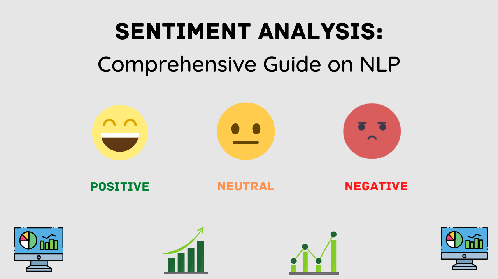

## Problem Identification Overview

We aim to find out how customers evaluate your competitors' product, namely what they like and dislike in a video game by using a **Natural Language Processing (NLP)**. Knowing what makes a video game attractive to a gamer helps the marketing team articulate the message of your product more effectively.

- Analyze customers’ reviews about video games
- Decide whether people like or dislike the video game they bought. Label each review with a sentiment score between -1 and 1.
- Employ different NLP methods

## Techniques Employed

- Sampling from imbalanced datasets using the imbalanced-learn package
- Enquiring about the sentiment value of the reviews with the dictionary-based sentiment analysis tools, which are part of NLTK, a natural language processing toolkit, used in Python.
- Evaluating models and creating descriptive statistics in Python with scikit-learn library 
   
## Dataset
[[detailed description](ipynb/sampling_dataset.ipynb)]

The Amazon review dataset can be downloaded from [Amazon review site](https://nijianmo.github.io/amazon/index.html).

- __reviewerID__ - ID of the reviewer, e.g. A2SUAM1J3GNN3B
- __asin__ - ID of the product, e.g. 0000013714
- **reviewerName** - name of the reviewer
- **vote** - helpful votes of the review
- **style** - a disctionary of the product metadata, e.g., "Format" is "Hardcover"
- **reviewText** - text of the review
- **overall** - rating of the product
- **summary** - summary of the review
- **unixReviewTime** - time of the review (unix time)
- **reviewTime** - time of the review (raw)
- **image** - images that users post after they have received the product

## UnderSampling Data

   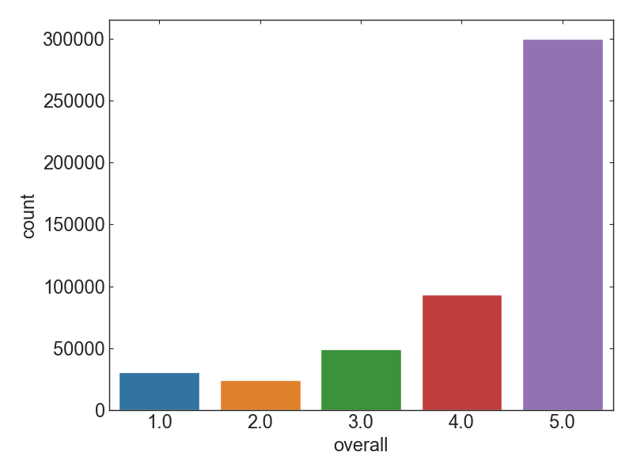
   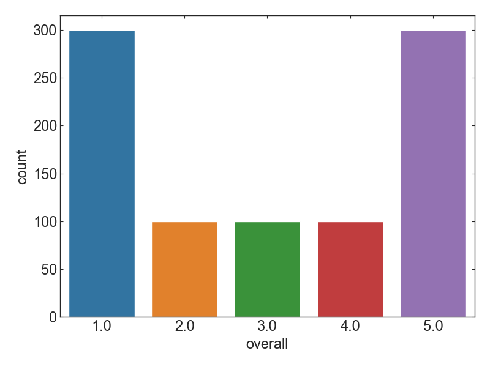
   
<i>Figure 1. Overall rating of game review in 2018 for all data (left panel) and undersampled data (right panel). </i>

## Sentiment Scoring
[[detailed description](ipynb/Sentiment_Scoring_BaselineModel.ipynb)]

We have two NLP methods to calcuate sentiment scores:

- SentiWordNet
- Opinion Lexicon

### SentiWordNet

   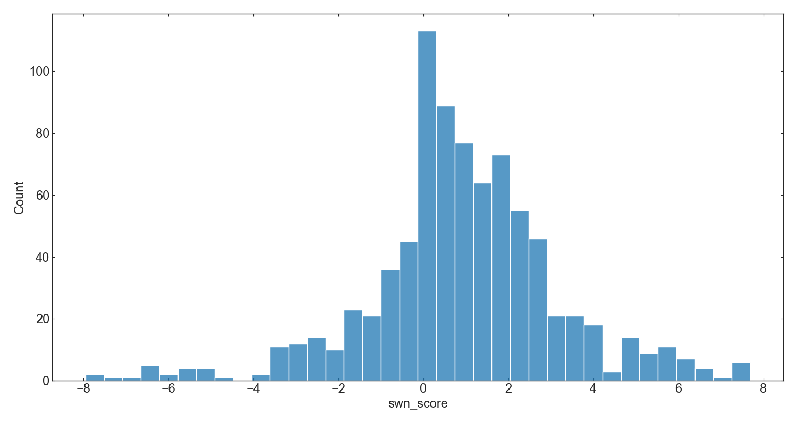
   
<i>Figure 2. Histogram of sentimental scores that was computed by SentiWordNet </i>

   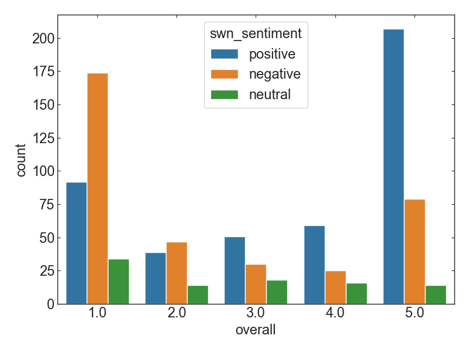
   
<i>Figure 3. Number counts of sentimental scores that is computed by SentiWordNet for each  rating. </i>

   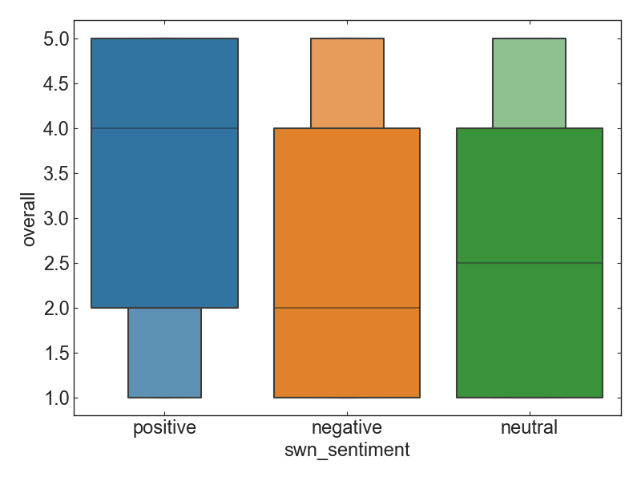
   
<i>Figure 4. Boxplot of sentimental scores that is computed by SentiWordNet. </i>

   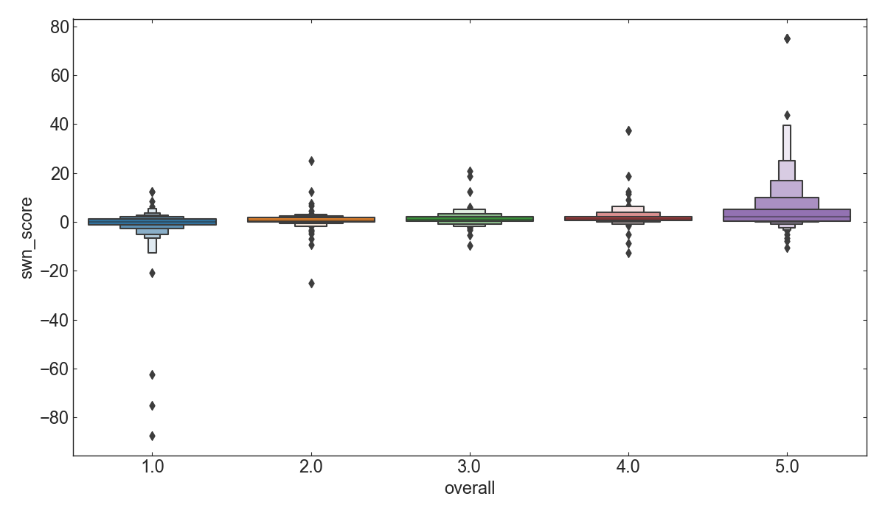
   
<i>Figure 5. Enhanced boxplot of sentimental scores that is computed by SentiWordNet for each rating. </i>

   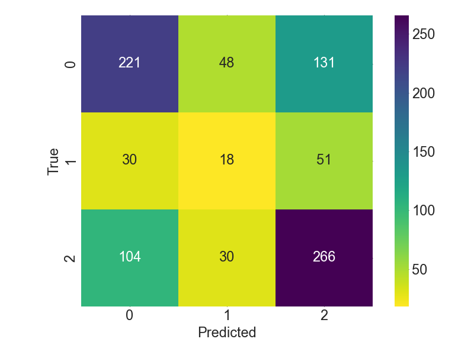
   
<i>Figure 6. Heatmap of sentiment keywords between ratings and sentiment scores from review texts. </i>

The performance is assessed by comparing of sentiment classification between true rating and review text:

- Negative respond
	- precision = 0.62
	- recall = 0.55
	- f1-score = 0.59
- Positive respond
	- precision = 0.59
	- recall = 0.67
	- f1-score = 0.63

### NLTK Opinion Lexicon

   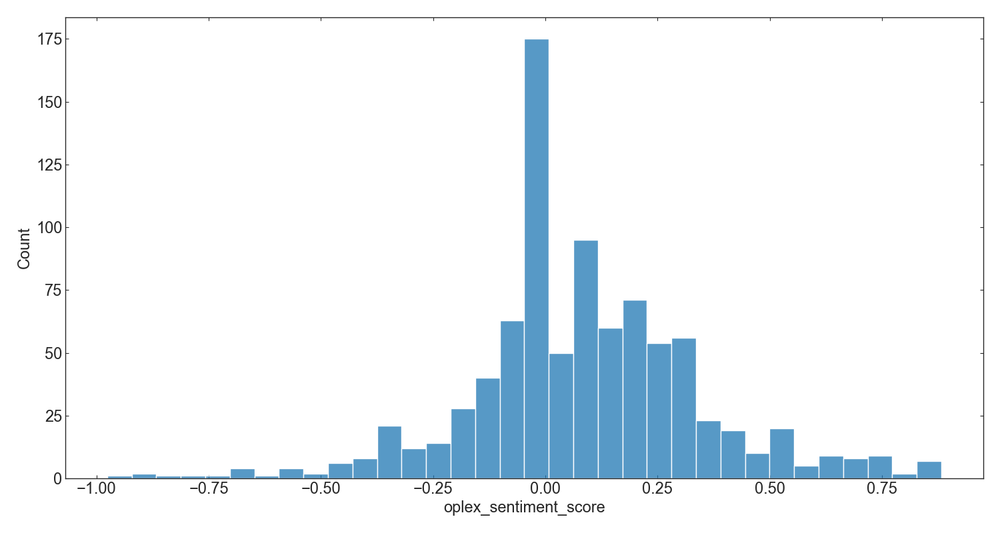
   
<i>Figure 7. Histogram of sentimental scores that was computed by Opinion Lexicon </i>

   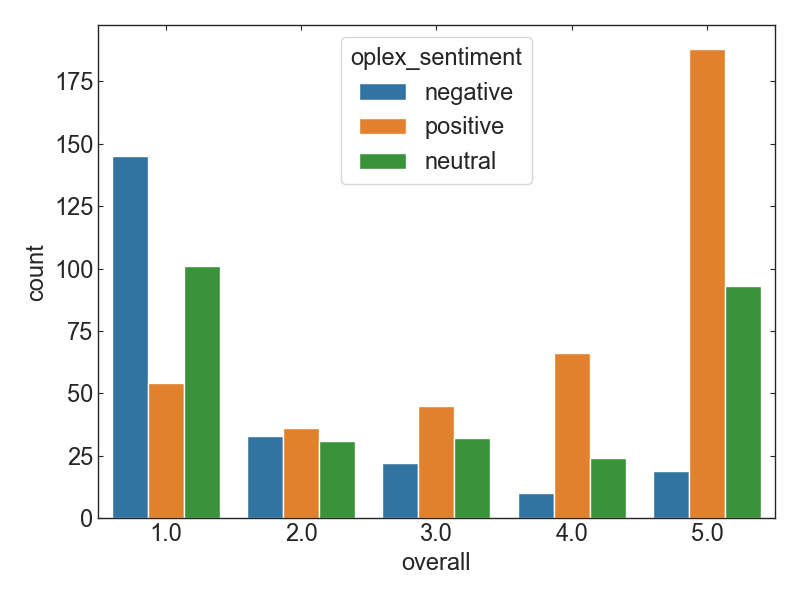
   
<i>Figure 8. Number counts of sentimental scores that is computed by Opinion Lexicon for each  rating. </i>

   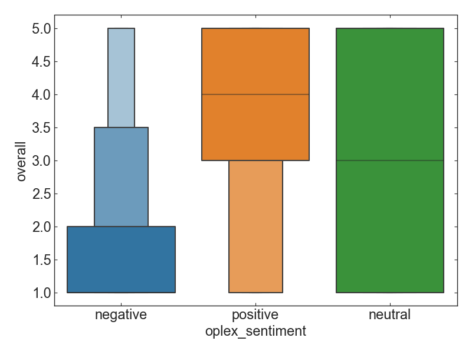
   
<i>Figure 9. Boxplot of sentimental scores that is computed by Opinion Lexicon. </i>

   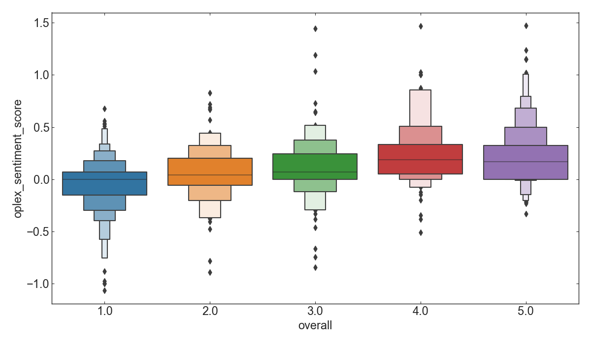
   
<i>Figure 10. Enhanced boxplot of sentimental scores that is computed by Opinion Lexicon for each rating. </i>

   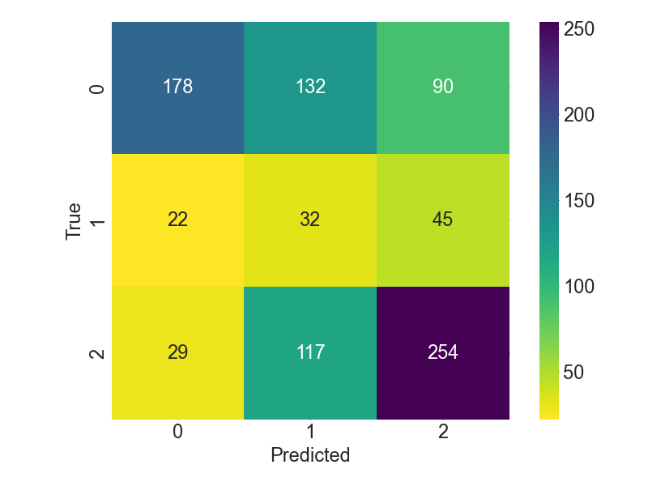
   
<i>Figure 11. Heatmap of sentiment keywords between ratings and sentiment scores from review texts. </i>

The performance is assessed by comparing of sentiment classification between true rating and review text:

- Negative respond
	- precision = 0.78
	- recall = 0.45
	- f1-score = 0.57
- Positive respond
	- precision = 0.65
	- recall = 0.64
	- f1-score = 0.64

Between `SentiWordNet` and `Opinion Lexicon`, the latter has better performance in this project. 
