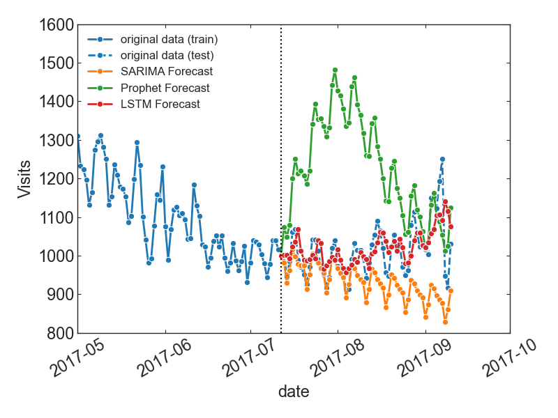
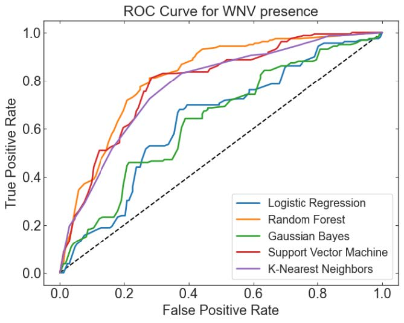

# ML_projects
Collection of Machine Learning Projects

## Web Traffic Time Series Forecast
\#Time Series \#Forecasting \#SARIMA \#Prophet \#LSTM

We aim to predict future web traffic for approximately a total of 145k Wikipedia articles to make better traffic control decisions. The increase in traffic for the websites could cause a lot of inconvenience for the users by a crashed site or very slow loading time. Therefore, a traffic management technique or plan should be put in place to reduce the risk of such problems.

Highlights:

   
   
<i>The predicted average daily view for 3 different models: orange, green, red lines
represent SARIMA, Prophet and LSTM forecast results, respectively. Blue line is actual data.</i>

## West Nile Virus Prediction
\#Binary Classification #Supervised #Imbalanced #Logistic Regression #Random Forest #Bayes #SVM #K-Nearest Neighbors

The primary goal is to build a model that predicts outbreaks of West Nile virus in mosquitos using the given environmental conditions, such as weather, season, and location.

Highlights:

   
   
<i>Comparison of receiver operating characteristic curve for the different models.</i>

