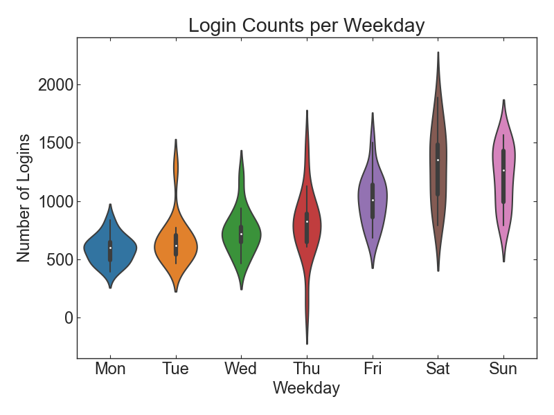

# Exploratory Data Analysis for Ultimate Login Activities

## Mission

The logins.json file contains (simulated) timestamps of user logins in a particular geographic location. Aggregate these login counts based on 15minute time intervals, and visualize and describe the resulting time series of login counts in ways that best characterize the underlying patterns of the demand. Report/illustrate important features of the demand, such as daily cycles.

## Exploratory Data Analysis

   
     
   
       
   
 <i> Figure 1. Total logins per month (top left), per week of year (top right), per weekdays (bottom left), and between weekday and weekend (bottom right) </i> 
   

- Login is the most active in March, showing the monotonous increase from January. Login activity drops to 13k, but it is because it contains the data only for 13 days.
- Logins are the most active in 12th week, which is the last week of March. Overall, login activities are increasing to 8th week, after which it shows plateau.
- Login activities keep increasing from Monday to Saturday.
- Logins are more active in weekend than in weekdays.

   
     
   
 <i> Figure 2. Box plot (left) and violin plot (right) for the total login activities per weekdays </i> 
   

- the total number of logins is increasing from Monday to Saturday. 
- One notable thing is that there are outliers on Tuesday, Wednesday, and Thursday, and the variation is the most on Saturday.

     
     
   
 <i> Figure 3. Daily cycle of login activites: bar chart (upper) and box plot (lower) </i> 
   

- Logins are the least active in the morning, and there are the highest logins at 11am - noon and 9pm - 1am.
- There are significant variation between 2am and 4am, and the smallest variation in the morning with the smallest logins.

