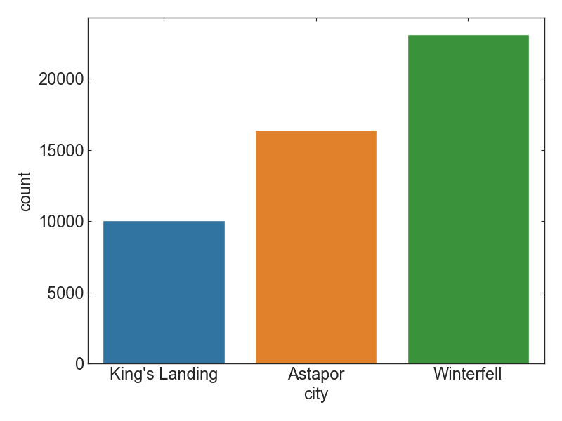
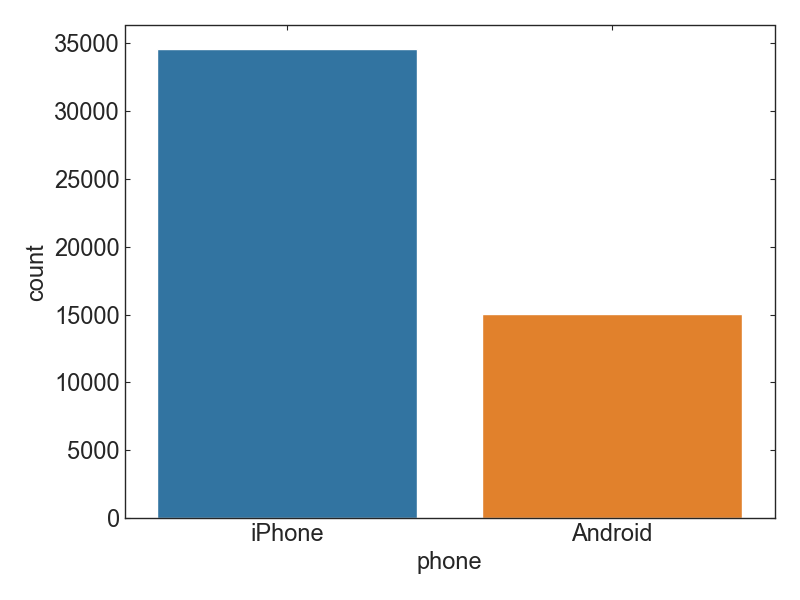
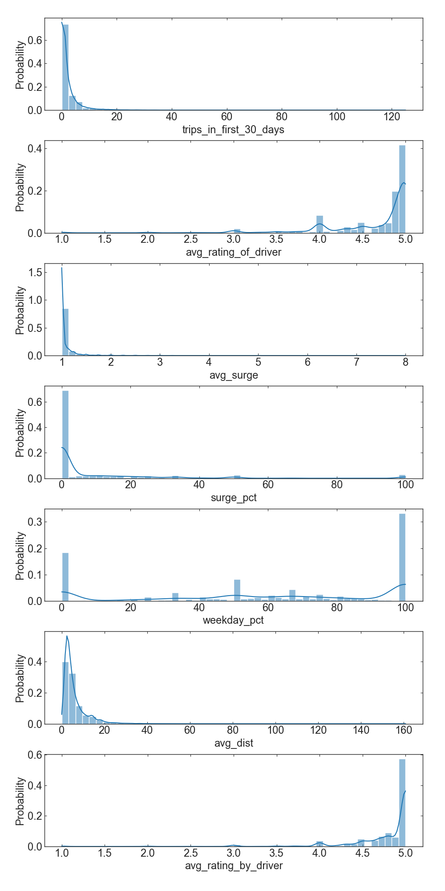
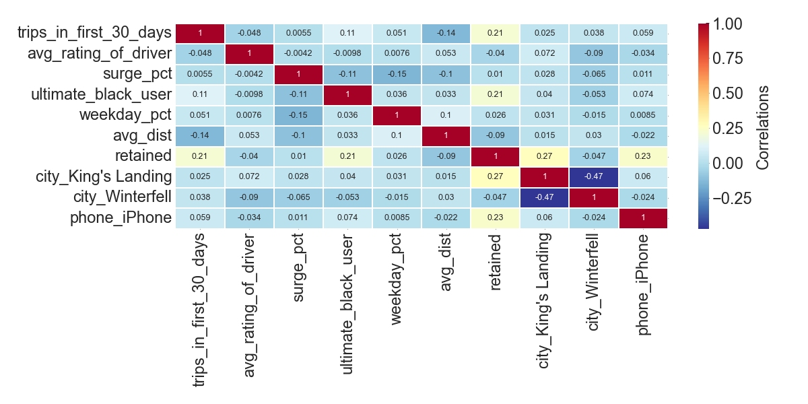
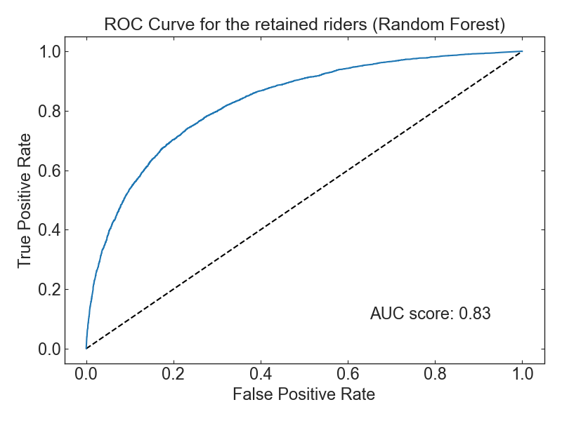
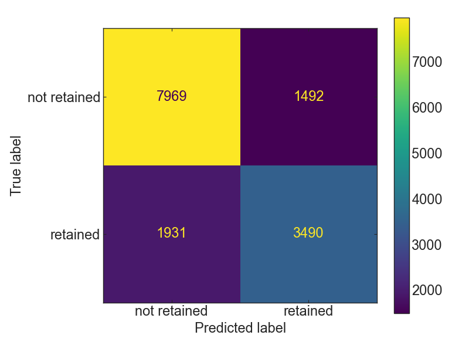
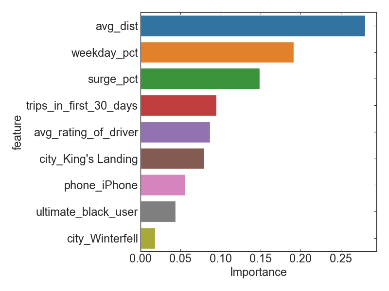
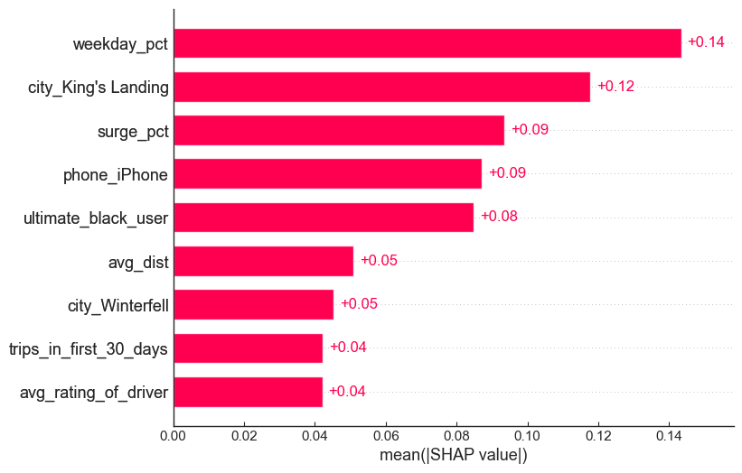
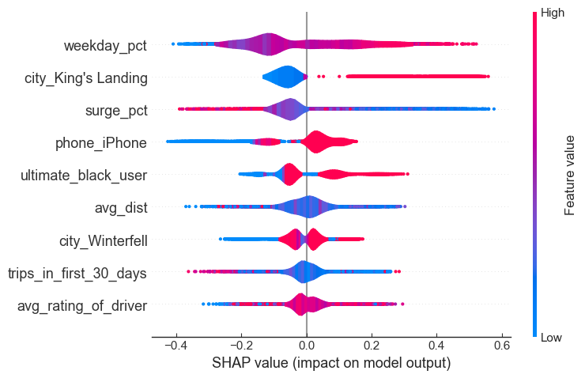

# Ultimate Rider Retention Prediction

## Mission

Ultimate is interested in predicting rider retention. To help explore this question, we have provided a sample dataset of a cohort of users who signed up for an Ultimate account in January 2014. The data was pulled several months later; we consider a user retained if they were “active” (i.e. took a trip) in the preceding 30 days.

We would like you to use this data set to help understand what factors are the best predictors for retention, and offer suggestions to operationalize those insights to help Ultimate.

## Data Description
- phone: primary device for this user
- signup_date: date of account registration; in the form ‘YYYYMMDD’
- last\_trip\_date: the last time this user completed a trip; in the form ‘YYYYMMDD’
- avg_dist: the average distance in miles per trip taken in the first 30 days after signup
- avg\_rating\_by\_driver: the rider’s average rating over all of their trips
- avg\_rating\_of\_driver: the rider’s average rating of their drivers over all of their trips
- surge_pct: the percent of trips taken with surge multiplier > 1
- avg_surge: The average surge multiplier over all of this user’s trips
- trips\_in\_first\_30\_days: the number of trips this user took in the first 30 days after signing up
- ultimate\_black\_user: TRUE if the user took an Ultimate Black in their first 30 days; FALSE otherwise
- weekday_pct: the percent of the user’s trips occurring during a weekday

## Exploratory Data Analysis

   
   
 <i> Figure 1. Total number of riders per city </i> 
   

- Number of riders is the largest in the city of Winterfell and the smallest in the city of King's Landing.

   
   
 <i> Figure 2. Total number of phone that riders use </i> 
   

- For the riders, iPhone users are more than Android users.

   
   
 <i> Figure 3. Histogram for all numeric data </i> 
   

## Feature Engineering
- categorical features are transformed by one-hot encoding.
- Features that are highly correlated with others are eliminated.

   
   
 <i> Figure 4. Heatmap that shows correlations between features </i> 
   

## Modeling
- make use of Random Forest Model
- conduct hyper-parameter tuning

   
   
 <i> Figure 5. Receiver Operating Characteristics curve for the predicted retained riders </i> 
   

   
   
 <i> Figure 6. Confusion matrix for the predicted retained riders </i> 
   

## Interpretation

   
   
 <i> Figure 7. Feature Importance that is computed by permutation feature importance technique. </i> 
   

- Major features of importance are `avg_dist`, `weekday_pct`, and `surge_pct` from feature_importnaces of model.

### SHAP Analysis

   
   
   
 <i> Figure 8. Feature Importance that is computed by SHAP analysis: bar plot(left) and violin plot(right) </i> 
   

- The results from Shap analysis is slightly different from feature_importances above. The high rank features in Shap analysis are `weekday_pct`, `city_King's Landing`, and `surge_pct`.
- However, we could see that overall, `weekday_pct`, `surge_pct`, `avg_dist` can be considered as important features.
- lower `surge_pct` results in higher shap value, implying more retiontion.
